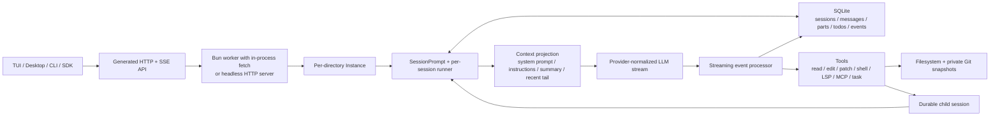
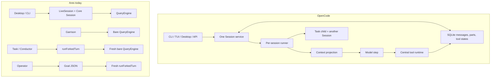
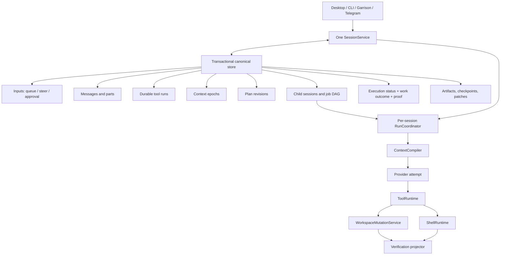

# Ares Coding Harness Reconstruction — Conversation Export

- Thread: Analyze OpenCode coding harness
- Thread ID: 019fbc30-9856-75e0-9c57-f8dd15f74522
- Workspace: D:\Ares
- Export date: 2026-08-01
- Order: chronological

> This is the user-visible conversation: user messages plus assistant commentary/final responses.
> Hidden chain-of-thought and raw tool output are intentionally not included. The companion Claude handoff and architecture report capture the implementation work and verification evidence.

---

## Turn 1

### User

[anomalyco/opencode](https://github.com/anomalyco/opencode) , figure out exactly how this works and how they do coding as a harness. we can compare it to ares. but opencode is perfect for long horizen coding. millions of people use it. if you lay out the exact arcitecture, how it codes, how it handles shit, how it does memory, how its so good at long horizen coding, how it compacts, subagents all that

### Assistant — progress update

I’m using the GitHub workflow skill because this is a repository-level architecture investigation. I’ll map OpenCode’s execution loop, tool/harness model, persistence, compaction, permissions, and subagents, then inspect Ares against the same dimensions so the comparison is concrete rather than impressionistic.

### Assistant — progress update

I found Ares is a TypeScript monorepo with an existing agent/core/CLI/Tauri split, and it currently has user changes in progress. I’ll keep the investigation read-only on Ares and use an isolated checkout of OpenCode so nothing collides with those edits.

### Assistant — progress update

The source confirms the core idea already: OpenCode’s “memory” is not a vector database. It is a durable event/transcript model plus anchored compaction summaries, retained recent turns, persistent todos, hierarchical instruction discovery, and recoverable child sessions. I’m now separating the shipping runtime from a newer V2 session core that exists in the same repository, because mixing those two would give a misleading architecture diagram.

### Assistant — progress update

I’ve finished the main OpenCode execution trace. I’m now separating what is truly shipping from the newer V2 architecture in the repo, then I’ll pin the Ares comparison to specific files so the recommendations are actionable rather than generic.

### Assistant — progress update

The biggest architectural distinction is now clear: OpenCode’s current product path is a durable session/event machine wrapped around a relatively small coding loop. The repo also contains a newer V2 core with durable prompt admission and context epochs, but its own checklist says several parity and crash-recovery pieces are unfinished—so I won’t blur roadmap code into “what makes today’s product work.”

### Assistant — progress update

I’ve finished the source trace and the Ares comparison. The central result is clear: OpenCode’s endurance comes from a re-entrant, persisted session loop plus disciplined context projection—not from unusually strong semantic memory—and its newer “durable runner” should not be confused with the shipping path.

### Assistant — final

# OpenCode, reverse-engineered

The blunt answer: OpenCode is strong at long-horizon coding because it treats the agent as a re-entrant session machine over persistent state. It does **not** have magical semantic memory. Its endurance comes from:

1. Persisting messages and tool states continuously.
2. Reloading that persisted state before every model step.
3. Running an effectively unbounded model → tool → observation loop.
4. Aggressively controlling what re-enters the context window.
5. Replacing old history with a structured, recursively anchored summary.
6. Giving subagents their own resumable child sessions.
7. Normalizing many models/providers behind one harness.

I audited commit [`19231fce`](https://github.com/anomalyco/opencode/commit/19231fce4b70aa5f7894a0a0eb20ff29bd417db5), dated July 31, 2026.

One scale correction: OpenCode reports **10,190,453 cumulative npm and Homebrew downloads** as of January 29, 2026. That establishes millions of installs/downloads, not millions of unique users. [Repository statistics](https://github.com/anomalyco/opencode/blob/19231fce4b70aa5f7894a0a0eb20ff29bd417db5/STATS.md#L217)

## The architecture



The default TUI normally launches a Bun worker and sends serialized Request/Response-shaped calls to it. The worker invokes the same server through `app.fetch`; a real network listener is optional. This gives every frontend a uniform API and isolates some process responsibilities, but the worker is **not a security sandbox**. [TUI startup](https://github.com/anomalyco/opencode/blob/19231fce4b70aa5f7894a0a0eb20ff29bd417db5/packages/opencode/src/cli/cmd/tui.ts#L198-L249), [worker implementation](https://github.com/anomalyco/opencode/blob/19231fce4b70aa5f7894a0a0eb20ff29bd417db5/packages/opencode/src/cli/tui/worker.ts#L23-L49), [server instance routing](https://github.com/anomalyco/opencode/blob/19231fce4b70aa5f7894a0a0eb20ff29bd417db5/packages/opencode/src/server/routes/instance/httpapi/server.ts#L212-L312)

### The important V1/V2 trap

The repository currently contains two session architectures:

- The mature, user-facing path still resolves and runs `SessionPrompt`.
- A newer V2 path adds durable admitted inputs, `steer` versus `queue`, context epochs, and a coalescing coordinator.

V2 is not the complete shipping architecture yet. Its own source lists unfinished durable ownership, status recovery, bounded retries, doom-loop handling, tool/plugin coverage, cancellation settlement, compaction continuation, summaries and cleanup. It explicitly says durable continuation recovery remains future work. Some V2 `compact` and `wait` operations return unavailable. [Current prompt handlers](https://github.com/anomalyco/opencode/blob/19231fce4b70aa5f7894a0a0eb20ff29bd417db5/packages/opencode/src/server/routes/instance/httpapi/handlers/session.ts#L273-L327), [V2 runner checklist](https://github.com/anomalyco/opencode/blob/19231fce4b70aa5f7894a0a0eb20ff29bd417db5/packages/core/src/session/runner/llm.ts#L43-L90), [unavailable V2 operations](https://github.com/anomalyco/opencode/blob/19231fce4b70aa5f7894a0a0eb20ff29bd417db5/packages/core/src/session.ts#L417-L429)

Any explanation that combines V1’s mature tool loop with V2’s durable inbox and presents it as one finished runtime is overstating the implementation.

## The exact coding arc

A normal coding request runs like this:

1. **The user message is persisted first.** `SessionPrompt.prompt` creates the user message and parts, touches the session, records per-request permissions, and only then starts or joins the loop. [Prompt admission](https://github.com/anomalyco/opencode/blob/19231fce4b70aa5f7894a0a0eb20ff29bd417db5/packages/opencode/src/session/prompt.ts#L1052-L1070)

2. **One active runner is allowed per session.** Concurrent callers for the same session join the existing runner. Different sessions can run concurrently. [Run-state coordination](https://github.com/anomalyco/opencode/blob/19231fce4b70aa5f7894a0a0eb20ff29bd417db5/packages/opencode/src/session/run-state.ts#L35-L105)

3. **At every provider step, it reloads the durable transcript.** It does not depend on a giant in-memory conversation object surviving indefinitely. It derives the latest user message, latest assistant message, pending subtask/compaction markers and current completion state again. [Main loop](https://github.com/anomalyco/opencode/blob/19231fce4b70aa5f7894a0a0eb20ff29bd417db5/packages/opencode/src/session/prompt.ts#L1081-L1168)

4. **It rebuilds the model environment.** That includes the selected agent/model, model-family-specific system prompt, platform/date/cwd/worktree/git information, project instructions, skills, MCP tools and permission-filtered built-ins. [System construction](https://github.com/anomalyco/opencode/blob/19231fce4b70aa5f7894a0a0eb20ff29bd417db5/packages/opencode/src/session/system.ts#L27-L128), [request construction](https://github.com/anomalyco/opencode/blob/19231fce4b70aa5f7894a0a0eb20ff29bd417db5/packages/opencode/src/session/llm/request.ts#L56-L214)

5. **It creates the assistant record and captures a filesystem snapshot** before the next model step.

6. **The provider response is streamed into an event processor.** Text, reasoning, tool calls, tool arguments, results, errors, tokens, cost and snapshots become explicit message/part state transitions. [Streaming processor](https://github.com/anomalyco/opencode/blob/19231fce4b70aa5f7894a0a0eb20ff29bd417db5/packages/opencode/src/session/processor.ts#L278-L597)

7. **Tools execute with session/message/call IDs, abort signals, progress reporting and permissions.** The registry includes read, glob, grep, edit/write, patch, shell, LSP, task, web, skills, MCP and plugin tools. [Tool registry](https://github.com/anomalyco/opencode/blob/19231fce4b70aa5f7894a0a0eb20ff29bd417db5/packages/opencode/src/tool/registry.ts#L201-L335)

8. **Tool results feed the next model step.** Because history is reloaded, newly persisted tool output—or another user prompt submitted while the agent is busy—can enter at the next safe loop boundary.

9. **The loop continues until there are no pending tool calls and a finished assistant response is newer than the latest user request.** The default step ceiling is effectively unbounded.

10. **Old tool output pruning and auxiliary title/summary work run asynchronously.**

That is the fundamental harness: a model repeatedly observes a projected durable state, chooses an action, receives a persisted result and re-enters.

## Why it survives long tasks

### 1. Fine-grained persistence

SQLite runs in WAL mode with foreign keys, normal synchronization and a busy timeout. Sessions, messages, parts and Todos are normalized records. Durable event publication, projector updates and sequence advancement happen inside one immediate SQLite transaction; subscribers are notified after commit. [Database configuration](https://github.com/anomalyco/opencode/blob/19231fce4b70aa5f7894a0a0eb20ff29bd417db5/packages/core/src/database/database.ts#L22-L54), [session schema](https://github.com/anomalyco/opencode/blob/19231fce4b70aa5f7894a0a0eb20ff29bd417db5/packages/core/src/session/sql.ts#L22-L176), [durable event transaction](https://github.com/anomalyco/opencode/blob/19231fce4b70aa5f7894a0a0eb20ff29bd417db5/packages/core/src/event.ts#L205-L395)

This is much safer than keeping the active conversation only in RAM and periodically dumping a blob.

### 2. Context is aggressively bounded

Ordinary tool/plugin output is capped at **2,000 lines or 50 KiB** before entering the transcript. Larger output is stored in a managed file for seven days; the model receives a preview and exact path. If Task is available, it is explicitly encouraged to have an explore agent inspect that file instead of flooding the parent context. [Tool-output truncation](https://github.com/anomalyco/opencode/blob/19231fce4b70aa5f7894a0a0eb20ff29bd417db5/packages/opencode/src/tool/truncate.ts#L13-L44), [spill behavior](https://github.com/anomalyco/opencode/blob/19231fce4b70aa5f7894a0a0eb20ff29bd417db5/packages/opencode/src/tool/truncate.ts#L85-L148)

Read itself is bounded, paginated, understands images/PDFs, rejects binary files and warms up LSP information.

### 3. Hierarchical instructions are discovered while coding

OpenCode loads global and project-level `AGENTS.md`/Claude-style instruction files. More importantly, when Read opens a file in a nested directory, it searches for nearby instruction files and injects newly discovered instructions as a persisted system reminder. [Instruction discovery](https://github.com/anomalyco/opencode/blob/19231fce4b70aa5f7894a0a0eb20ff29bd417db5/packages/opencode/src/session/instruction.ts#L110-L220), [Read integration](https://github.com/anomalyco/opencode/blob/19231fce4b70aa5f7894a0a0eb20ff29bd417db5/packages/opencode/src/tool/read.ts#L300-L365)

That helps the agent enter unfamiliar subtrees without relying on the root prompt to describe the entire repository.

### 4. Provider behavior is normalized

The harness has model-family-specific system prompts and provider transforms rather than pretending every model obeys identical tool semantics. Tool names are repaired, tools are stably ordered, provider caching/session headers are applied, and request options are merged across model, config, agent and variant layers.

This is a large part of why it feels reliable across models: the compatibility work lives in the harness.

### 5. Retries prioritize persistence over fast failure

Retryable failures back off exponentially from two seconds, cap at 30 seconds unless provider headers specify otherwise, and treat context overflow specially. There is no normal attempt ceiling, so a retryable outage can retry indefinitely until success or cancellation. [Retry classification](https://github.com/anomalyco/opencode/blob/19231fce4b70aa5f7894a0a0eb20ff29bd417db5/packages/opencode/src/session/retry.ts#L26-L75), [retry scheduling](https://github.com/anomalyco/opencode/blob/19231fce4b70aa5f7894a0a0eb20ff29bd417db5/packages/opencode/src/session/retry.ts#L176-L198)

That improves apparent endurance, but it can also hang forever.

## What “memory” actually means

OpenCode core has no vector index, embeddings pipeline or semantic cross-session retrieval in the coding path.

Its memory is:

- SQLite transcript and tool-part state.
- Compaction summaries plus a recent verbatim tail.
- Durable child-session transcripts.
- Project instruction files.
- Todos as application state.
- The filesystem and Git state.

| Survives restart | Process-local and lost |
|---|---|
| Sessions, messages, parts and Todos | Active runner ownership |
| Compaction summary and tail marker | Busy/retry status |
| Child-session transcripts | “Always approve” decisions |
| Usage, cost and stored permission rules | Background-job ownership/status |
| Filesystem changes and stored snapshots | Exact in-flight execution position |

`opencode --continue` selects a persisted session and sends another prompt. It does not resurrect the exact instruction pointer of a crashed run. [Continue behavior](https://github.com/anomalyco/opencode/blob/19231fce4b70aa5f7894a0a0eb20ff29bd417db5/packages/opencode/src/cli/cmd/run.ts#L456-L526), [process-local status](https://github.com/anomalyco/opencode/blob/19231fce4b70aa5f7894a0a0eb20ff29bd417db5/packages/opencode/src/session/status.ts#L26-L48), [non-durable background jobs](https://github.com/anomalyco/opencode/blob/19231fce4b70aa5f7894a0a0eb20ff29bd417db5/packages/core/src/background-job.ts#L113-L124)

## Compaction, exactly

OpenCode’s compaction is one of its strongest design choices:

1. It reserves 20,000 tokens by default when calculating usable context.

2. It attempts to retain the last two user turns verbatim, but only within 25% of usable context, clamped between 2,000 and 8,000 tokens. It may split inside an oversized turn. [Tail selection](https://github.com/anomalyco/opencode/blob/19231fce4b70aa5f7894a0a0eb20ff29bd417db5/packages/opencode/src/session/compaction.ts#L28-L127)

3. Everything older becomes the summary “head.”

4. Previous compaction marker/summary pairs are removed from the source history, but the newest prior summary is supplied **in full as an anchor**.

5. A hidden compaction agent receives the old head, no tools, media removed, and each tool output truncated to 2,000 characters.

6. It is instructed to update the previous summary, preserve still-true facts and remove stale ones using a fixed schema:

   - Objective
   - Important Details
   - Work State: Completed / Active / Blocked
   - Next Move
   - Relevant Files

   Exact paths, symbols, commands, errors and URLs are explicitly preserved. [Summary schema](https://github.com/anomalyco/opencode/blob/19231fce4b70aa5f7894a0a0eb20ff29bd417db5/packages/core/src/session/compaction.ts#L12-L46)

7. The generated assistant message is stored with `summary: true`, along with `tail_start_id`.

8. Future model context is projected as:

   `compaction marker → anchored summary → recent verbatim tail → newer continuation`

   The omitted originals remain in SQLite; they are simply absent from future model requests. [Context projection](https://github.com/anomalyco/opencode/blob/19231fce4b70aa5f7894a0a0eb20ff29bd417db5/packages/opencode/src/session/message-v2.ts#L521-L571)

9. Auto-compaction then replays the current user request when possible or inserts a synthetic continuation. Oversized media requests get explicit placeholders so the request is not silently forgotten. [Continuation handling](https://github.com/anomalyco/opencode/blob/19231fce4b70aa5f7894a0a0eb20ff29bd417db5/packages/opencode/src/session/compaction.ts#L415-L503)

Separate old-tool pruning exists, but it is **disabled by default**. When enabled, it protects the newest 40,000 tool-output tokens and only marks older results compacted once at least 20,000 eligible tokens can be removed. It does not delete the source row; provider projection substitutes an “old result cleared” marker. [Pruning implementation](https://github.com/anomalyco/opencode/blob/19231fce4b70aa5f7894a0a0eb20ff29bd417db5/packages/opencode/src/session/compaction.ts#L241-L287), [default configuration](https://github.com/anomalyco/opencode/blob/19231fce4b70aa5f7894a0a0eb20ff29bd417db5/packages/core/src/v1/config/config.ts#L149-L166)

The full previous-summary anchor is the key. It reduces the progressive “telephone game” effect across repeated compactions.

It is still lossy: media disappears, tool results are clipped, token estimation is approximately characters divided by four, and a summary call can itself overflow.

## Subagents

The active built-ins at this commit are:

- `build` and `plan` as primary agents.
- `general` and `explore` as user-facing subagents.
- Hidden compaction/title/summary agents with restricted tools.

The documentation mentions a Scout agent, but it does not exist in the active registry at this commit; that appears to be documentation/version skew. [Active agent registry](https://github.com/anomalyco/opencode/blob/19231fce4b70aa5f7894a0a0eb20ff29bd417db5/packages/opencode/src/agent/agent.ts#L140-L264)

A Task call:

1. Creates a real child `Session` with `parentID`.
2. Sends it the delegated prompt and normal project/system instructions.
3. Does **not** copy the entire parent transcript.
4. Runs the same coding loop inside the child.
5. Returns only the child’s final text to the parent.
6. Keeps the child transcript independently navigable.
7. Accepts `task_id` to continue the same child later.

[Task session creation and continuation](https://github.com/anomalyco/opencode/blob/19231fce4b70aa5f7894a0a0eb20ff29bd417db5/packages/opencode/src/tool/task.ts#L136-L253)

This is excellent context hygiene: the parent gets a concise answer while the complete investigation remains accessible in the child.

Limitations:

- Default subagent depth is one.
- Background subagents are experimental.
- Background-job ownership is process-local.
- Distinct child agents share the parent worktree and can race on files.
- There is no global subagent concurrency budget.
- Permission inheritance preserves parent session-level denies and external-directory rules, but the child agent’s own profile controls most capabilities. [Permission derivation](https://github.com/anomalyco/opencode/blob/19231fce4b70aa5f7894a0a0eb20ff29bd417db5/packages/opencode/src/agent/subagent-permissions.ts#L4-L26)

## What OpenCode does not solve

OpenCode is very good, but it is not a durable workflow engine:

- No core semantic cross-session memory.
- No automatic resurrection of an interrupted live run.
- V1 active runner and status are process-local.
- V2 durability is incomplete and not the default path.
- Indefinite provider retry can wedge a session.
- Three identical tool calls cause a permission prompt, not guaranteed termination.
- Background agents are not crash-durable.
- Parallel child writers share one worktree.
- Permissions are application policy, not OS/container isolation.
- Git snapshots help recovery but do not make tool execution transactional.
- `apply_patch` validates hunks first but sequential filesystem writes can still partially complete.
- Compaction inevitably loses information.

## OpenCode versus Ares

Ares’s problem is not lack of sophisticated mechanisms. It already has several things stronger than OpenCode. Its problem is that those guarantees are fragmented across the interactive runtime, Garrison, Conductor and Operator.

| Area | OpenCode | Ares today |
|---|---|---|
| Session durability | SQLite transaction/event/projector model, persisted per message/part | Ordered JSONL/session persistence with a turn-end durability barrier; less transactional. See [session persistence](D:/Ares/packages/core/src/session.ts:107) |
| Core loop | Small re-entrant session state machine that reloads DB state | Powerful but very large `QueryEngine` loop. See [main loop](D:/Ares/packages/core/src/queryEngine.ts:1160) |
| Context budgeting | Fixed reserve, approximate char/4 estimation | Better: live provider calibration, fuller preflight and adaptive image/tool reduction. See [context budgeting](D:/Ares/packages/core/src/queryEngine.ts:967) |
| Compaction | Full previous-summary anchor, fixed schema, logical projection | Better microcompaction, deterministic ledger fallback and live file re-pinning, but previous recap enters later summaries as a reminder clipped around 1,500 characters, increasing repeated-compaction decay. See [compaction implementation](D:/Ares/packages/core/src/queryEngine.ts:1060) and [summary rendering](D:/Ares/packages/cli/src/entry/sessionFactory.ts:433) |
| Long-term memory | No core semantic retrieval | Stronger: coding journal, lexical memory and optional embeddings. See [coding journal](D:/Ares/packages/core/src/codingJournal.ts:59), [memory store](D:/Ares/packages/mind/src/memory/store.ts:1), [unified recall](D:/Ares/packages/agent/src/memory/unifiedRecall.ts:46) |
| Verification | Snapshots, tool errors, basic identical-call doom-loop detection | Much stronger: mutation generations, verifier objections, proof/GUI checks, persistent verification debt and more loop guards. See [verification gate](D:/Ares/packages/core/src/queryEngine.ts:1753) |
| Provider recovery | Huge compatibility surface and persistent unbounded retry | Better failure semantics: bounded pre-output retry, stall handling, history shrink/reasoning downshift and daemon-level provider/model failover. See [provider recovery](D:/Ares/packages/core/src/queryEngine.ts:1385) |
| Tool concurrency | Normal model tool execution and child-session concurrency | Explicit dependency-aware batching with deterministic result ordering. See [tool batching](D:/Ares/packages/core/src/queryEngine.ts:2388) |
| Ordinary subagents | Durable child session, navigable trace, `task_id` continuation | One-shot forked turn with structured handoff, but not naturally resumable. See [subagents](D:/Ares/packages/core/src/subagents.ts:1) |
| Fleet orchestration | Child sessions share the worktree | Ares Conductor is stronger: typed DAGs, reducers, budgets, overlap checks and worktree isolation. See [Conductor](D:/Ares/packages/core/src/conductor.ts:1) |
| Durable goals | Session transcript is the primary continuity unit | Operator’s “durable immortal goal, fresh mortal worker” is a stronger abstraction. See [Operator](D:/Ares/packages/operator/src/controlLoop.ts:1) |
| Runtime cohesion | Better-defined shipping session/API surface, despite V1/V2 migration | Desktop, [Garrison](D:/Ares/packages/garrison/src/sessions.ts:1), Conductor and Operator do not all share the same session guarantees |
| Steering | Persist prompt and normally observe it at the next loop boundary; V2 formalizes queue/steer | Current daemon steering aborts active work; the force-unlock watchdog can permit overlap if underlying work is still alive. See [steering](D:/Ares/packages/cli/src/entry/daemon.ts:1775) and [watchdog](D:/Ares/packages/cli/src/entry/daemon.ts:512) |

The concise verdict:

- **OpenCode has the better session substrate.**
- **Ares has the better cognition, verification, memory and fleet mechanisms.**
- **Ares’s superior pieces are spread across several non-equivalent runtimes.**

## What Ares should take from it

### P0: fix the substrate

1. Build one canonical `SessionKernel` backed by SQLite.

   Normalize sessions, messages, parts, tool calls, Todos, context epochs and admitted inputs. Persist each transition transactionally. Desktop, Garrison, Operator and Conductor should all consume this kernel.

2. Add a durable prompt inbox.

   Every input should have an idempotency key and `steer | queue` delivery mode. Commit it before waking the runner. Promote it only at an explicit provider/tool boundary. Ordinary steering should not abort an active mutating tool.

3. Separate execution state from outcome truth.

   For example:

   - Execution: `idle | running | interrupted | failed`
   - Outcome: `verified | unverified | blocked | not_applicable`

   A turn should not be externally reported as successfully completed merely because the generator stopped.

### P1: hybridize compaction and recovery

4. Keep Ares’s calibrated budgeting, microcompaction, deterministic fallback and live-file freshness, but adopt OpenCode’s:

   - Full previous-summary anchor.
   - Fixed recap schema.
   - Separate summarized head and verbatim recent tail.
   - Logical projection rather than destructive history replacement.
   - Replay protection for the current request.
   - Explicit media placeholders.

   Keep file re-pinning, but tightly budget it or persist paths plus targeted rereads instead of injecting tens of thousands of characters.

5. Introduce typed context sources and epochs.

   System baseline, repository instructions, nested instructions, skills, memory, Git state and coding journal should be independently versioned sources rather than one mutable prompt blob.

6. Persist tool state around side effects.

   Record `pending` before execution and `completed/error` immediately afterward. On restart, reconcile `running` tools as `unknown/interrupted` and force verification before any retry.

### P2: unify delegation

7. Turn ordinary Ares subagents into durable child sessions with stable IDs, continuation and navigable traces.

8. Retain Conductor’s typed handoffs and worktree isolation; do not copy OpenCode’s same-worktree parallel-writer behavior.

9. Persist each Conductor leaf result as it completes instead of writing the resume map only after the entire fleet returns.

10. Add long-horizon failure tests:

   - Restart during a mutating tool.
   - Five consecutive compactions.
   - Prompt submitted while busy.
   - 100k-line tool output.
   - Provider failover mid-turn.
   - Child-session continuation after restart.
   - Two agents editing the same file.
   - “Execution stopped” versus “work verified” truth.

## Bottom line

OpenCode is not “perfect because of memory.” Its core trick is much more concrete:

> Persist the observable session, rebuild the model’s working context every step, bound noisy evidence, summarize old state against a stable prior recap, and make delegation addressable.

Ares already has the harder intelligence features: calibrated context handling, semantic recall, durable coding state, stronger loop guards, verification debt, safer writes, provider failover and serious fleet orchestration.

The highest-leverage move is therefore **not to clone OpenCode**. It is to put Ares’s existing capabilities on top of an OpenCode-style transactional session kernel with durable inputs, resumable child sessions and anchored repeated compaction.

---

## Turn 2

### User

now compare that against ares coding arcitecture, this will explain exactly what were doing wrong, with upgrading editing, long hirizen coding, subagents , all that

### Assistant — progress update

I’m going to trace Ares through the same lifecycle as OpenCode—prompt admission, context assembly, model/tool loop, edit safety, persistence, compaction, steering, verification, and delegation—then identify the architectural causes rather than just listing feature gaps. I’ll keep this read-only and turn it into a prioritized upgrade design.

### User

another thing people point out is how well it does write, read, bash, along with most of its tools. it rarely fails

### Assistant — progress update

Yes—that’s a separate and very important axis. OpenCode’s tools succeed often because the whole path is designed around simple schemas, bounded outputs, exact corrective errors, and one consistent tool wrapper. Ares’s individual Read/Edit/Write implementations are actually strong, but they sit behind more routing, permission, checkpoint, dynamic-tool, verifier, and runtime-specific layers; that extra machinery creates more failure surfaces. I’m adding a tool-by-tool reliability comparison, including Bash.

### Assistant — progress update

The comparison is sharpening: Ares’s editor primitives are often safer than OpenCode’s, but the surrounding harness can invalidate that advantage. I’ve already confirmed non-durable prompt admission, non-transactional tool events, resume replay duplication, and a particularly serious fleet issue: Ares’s “worktree” isolation is currently an empty temp directory plus file copying—not a Git worktree—so delegated coders can lack the repository they need and merges cannot faithfully represent deletes or renames.

### Assistant — progress update

The shell comparison confirms the same pattern. OpenCode exposes one compatibility-stable `bash` tool whose prompt/schema are generated for the actual selected shell, parses commands for permissions, streams output, preserves the full stream to disk as soon as it grows, and returns a bounded tail. Ares exposes both Bash and PowerShell with a larger schema and stronger Windows process-tree handling, but its foreground runner discards earlier output before the central spill layer ever sees it. The later “full output saved” mechanism can therefore save only an already-truncated result.

### User

and they love the plan / execute mode too , like plan mode it wont execute, u can talk with it for hours, and when ur ready to build it does everything u talked about yk? i think thats something to look at too

### Assistant — progress update

Absolutely. That belongs in the same diagnosis: plan mode is not merely “hide write tools.” Its real test is whether hours of decisions become durable, structured build intent and whether switching to execute preserves that intent without re-explaining it. I’m adding a source-level comparison of OpenCode’s Plan→Build handoff against Ares’s Enter/ExitPlanMode path and will treat mode-transition continuity as a first-class architecture requirement.

### Assistant — progress update

One important nuance from the source: OpenCode’s Plan experience is better at continuity, but Ares is actually stricter at capability enforcement. Ares blocks every non-read-only safety class in plan mode; OpenCode’s plan agent denies edit permissions and strongly prompts against mutation, but its shell permission is not categorically denied. The design to copy is the durable plan artifact and explicit approved handoff—not weaker enforcement.

### Assistant — final

# Verdict

Yes—this comparison explains the problem.

> Ares built many of the clever parts above the wrong abstraction.

OpenCode’s advantage is not a magical prompt or model. It has one comparatively boring, consistent coding substrate: durable session state → context projection → model step → tool state → durable result → repeat.

Ares has stronger verification, richer memory, safer individual editors, better provider recovery, background shells, Conductor, and Operator—but these sit across several different runtimes. A feature works in Desktop, disappears in Garrison, weakens inside Task, and changes again inside Operator.

That fragmentation is why OpenCode feels dependable while Ares can feel temperamental despite containing more safety code.

I audited OpenCode at commit [`19231fce`](https://github.com/anomalyco/opencode/tree/19231fce4b70aa5f7894a0a0eb20ff29bd417db5) and the current Ares working tree based on `ca48a7f`. I did not modify anything. “Rarely fails” is a user-perception claim, not a benchmark I measured, but the source strongly explains it.

## The architectural difference



OpenCode reuses the session. Ares reuses `QueryEngine`.

That sounds subtle, but most of Ares’s guarantees—checkpoints, coding journal, continuous verification, recall, failure memory, persistence, provider failover—live outside `QueryEngine`. Every bare construction silently loses some of them.

Production Ares has three direct `QueryEngine` construction paths: interactive [Session](D:/Ares/packages/core/src/session.ts:149), delegated [runForkedTurn](D:/Ares/packages/core/src/forkedTurn.ts:53), and [Garrison](D:/Ares/packages/cli/src/entry/garrisonCmd.ts:114). They are not equivalent harnesses.

## Direct comparison

| Area | OpenCode | Ares | Result |
|---|---|---|---|
| Canonical runtime | One durable Session loop | Core Session, Garrison SessionManager, forked turns, Operator goals | Guarantees vary by entry point |
| Input admission | User message is persisted before the loop starts | User is placed in memory; JSONL persistence is queued afterward | Crash/reconnect ambiguity |
| Model loop | Reloads durable messages every iteration | Drives one large mutable in-memory generator | Live state and recovered state diverge |
| Tool state | Tool parts are durable session state | `tool_start`/`tool_end` are asynchronous log events around effects | Cannot reliably reconcile crash-during-tool |
| Editing surface | Provider-specific minimal belt | Several overlapping editors and shell-writing paths | More malformed calls and inconsistent safety |
| Compaction | Runs at model boundaries with previous summary anchor | Heavy compaction runs once near turn start | One long coding turn can forget its mission |
| Plan→Build | Agent identity plus durable plan artifact and explicit handoff | Mutable permission flag and plan inside one tool result | Hours of decisions are not a build contract |
| Task agents | Addressable child sessions with continuation ID | Stateless prompt-in/summary-out runs | Repeated rediscovery |
| Verification | Mostly LSP/tool feedback | Much stronger proof gates | Ares wins—but only on fully composed paths |
| Long-term memory | Limited | Semantic/failure memory and CodingJournal | Ares wins, but long-term memory cannot replace working-state durability |

OpenCode’s current session loop persists the prompt before entering the runner and reloads stored history on each iteration. [Prompt admission and loop](https://github.com/anomalyco/opencode/blob/19231fce4b70aa5f7894a0a0eb20ff29bd417db5/packages/opencode/src/session/prompt.ts#L1052-L1199)

## Why OpenCode’s Read, Write, Edit, and Bash feel reliable

### 1. It gives each model a smaller, familiar tool belt

For GPT-family models, OpenCode exposes ApplyPatch instead of Edit and Write. Other models receive Edit/Write. It deliberately avoids showing both dialects simultaneously. [Tool selection](https://github.com/anomalyco/opencode/blob/19231fce4b70aa5f7894a0a0eb20ff29bd417db5/packages/opencode/src/tool/registry.ts#L286-L297)

Ares exposes:

- Edit
- Write
- ApplyIntent
- FindAndEdit
- CodeMode writes
- Bash rewrites
- PowerShell rewrites

Ares already has an apply-patch parser, but no executable ApplyPatch tool is registered. [Parser](D:/Ares/packages/core/src/applyPatch/parser.ts:1), [registered coding tools](D:/Ares/packages/cli/src/entry/engineTools.ts:184)

For GPT/Codex-family models, that is likely one of the biggest avoidable reliability losses.

Recommended belts:

- GPT/Codex: Read, ApplyPatch, Shell
- Claude-style models: Read, Edit, Write, Shell
- ApplyIntent: internal fallback, not a peer editing dialect

### 2. OpenCode has fewer hidden prerequisites

OpenCode Edit reads the current file under a normalized-path semaphore and performs the edit. It does not depend on an invisible previous Read receipt. [Edit lock and execution](https://github.com/anomalyco/opencode/blob/19231fce4b70aa5f7894a0a0eb20ff29bd417db5/packages/opencode/src/tool/edit.ts#L35-L161)

Ares’s read-before-write idea is valuable, but its implementation creates surprising failure states:

- Whole-file rereads may be suppressed because the tool believes the content remains in context. [Read guard](D:/Ares/packages/tools/src/Read.ts:123)
- A 2,000-line partial Read records the hash of the entire file.
- The mere existence of that stamp authorizes a subsequent full Write. [Write authorization](D:/Ares/packages/tools/src/Write.ts:57)
- Garrison shares one read-stamp map across sessions, meaning one session’s Read can authorize another session’s Write. [Garrison shared state](D:/Ares/packages/cli/src/entry/garrisonCmd.ts:98)

The replacement should be an explicit persisted receipt containing session ID, hash, observed ranges, completeness, and context epoch. Full replacement requires `complete: true` or an explicit base hash.

### 3. OpenCode owns output bounding centrally

Every ordinary tool passes through one wrapper that validates arguments and applies uniform output truncation/spilling. [Central wrapper](https://github.com/anomalyco/opencode/blob/19231fce4b70aa5f7894a0a0eb20ff29bd417db5/packages/opencode/src/tool/tool.ts#L99-L145)

Its shell goes further: it streams output, begins saving the complete stream once it exceeds the limit, retains a bounded tail, and returns the spill path. [Shell output handling](https://github.com/anomalyco/opencode/blob/19231fce4b70aa5f7894a0a0eb20ff29bd417db5/packages/opencode/src/tool/shell.ts#L438-L593)

Ares foreground Bash discards older output while capturing it. The later QueryEngine spill layer can therefore save only the already-truncated result. [Bash buffering](D:/Ares/packages/tools/src/Bash.ts:185), [later spill](D:/Ares/packages/core/src/queryEngine.ts:813)

That is a concrete reason OpenCode handles long builds and compiler logs better.

### 4. Ares’s editors are safer individually—but inconsistent collectively

Ares has excellent safeguards worth keeping:

- Exact stale-hash detection
- Atomic same-file batch validation
- Ambiguity refusal
- Shrink protection
- Backups
- Post-write checks
- Dependency-aware batching
- Continuous verification

See [Edit](D:/Ares/packages/tools/src/Edit.ts:136), [Write](D:/Ares/packages/tools/src/Write.ts:69), and [safeOverwrite](D:/Ares/packages/tools/src/safeWrite.ts:45).

But there is no single mutation chokepoint:

- Edit directly calls `fs.writeFile`. [Edit write](D:/Ares/packages/tools/src/Edit.ts:201)
- FindAndEdit can partially apply a multi-file refactor.
- CodeMode can write several files and then throw.
- ApplyIntent adds another probabilistic model call before replacement.
- `safeOverwrite` itself writes in place, not temp-file → fsync → atomic rename.
- There is no workspace-global path lock across sessions or processes.

Ares has a central parser/permission adapter, but that wrapper does not own the complete effect transaction. [Tool adapter](D:/Ares/packages/tools/src/_shared.ts:292)

### 5. OpenCode exposes one shell contract

OpenCode keeps the compatibility-stable tool name `bash`, but dynamically describes and invokes the actual selected Bash, PowerShell, or cmd shell. It parses commands with tree-sitter for permission patterns and path handling. [Shell identity](https://github.com/anomalyco/opencode/blob/19231fce4b70aa5f7894a0a0eb20ff29bd417db5/packages/opencode/src/tool/shell/id.ts#L1-L16), [parsing](https://github.com/anomalyco/opencode/blob/19231fce4b70aa5f7894a0a0eb20ff29bd417db5/packages/opencode/src/tool/shell.ts#L378-L413)

Ares gives the model Bash and PowerShell simultaneously and requires an additional `description` argument. Ares does have better Windows tree-killing and first-class background process management, which should be retained. [Bash](D:/Ares/packages/tools/src/Bash.ts:127), [ShellRegistry](D:/Ares/packages/tools/src/ShellRegistry.ts:168)

Ares shell problems:

- Non-zero exits are returned as successful tool executions, so they do not increment the normal failure circuit breaker.
- Earlier foreground output is irretrievably discarded.
- Background output is a process-local ring buffer.
- Bash/PowerShell are statically classified `workspace-write`, despite being capable of external-state or out-of-workspace effects.

The right outcome model is `succeeded | completed_with_error | timed_out | interrupted | effect_unknown`, separate from whether the tool invocation itself threw.

## Plan → Execute is one of the clearest gaps

OpenCode officially exposes built-in Build and Plan agents. [OpenCode Agents documentation](https://opencode.ai/docs/agents/)

At the pinned commit, its richer plan-file/approval workflow is feature-gated behind `OPENCODE_EXPERIMENTAL_PLAN_MODE`, but the design is concrete:

1. Plan and Build are first-class agents with different permissions. [Agent definitions](https://github.com/anomalyco/opencode/blob/19231fce4b70aa5f7894a0a0eb20ff29bd417db5/packages/opencode/src/agent/agent.ts#L140-L180)
2. Every user message records its selected agent.
3. Plan mode incrementally creates or updates a stable `.opencode/plans/<session>.md` artifact. [Plan path](https://github.com/anomalyco/opencode/blob/19231fce4b70aa5f7894a0a0eb20ff29bd417db5/packages/opencode/src/session/session.ts#L331-L335)
4. The workflow encourages repository exploration, questions, design review, exact file paths, and verification instructions. [Plan reminder](https://github.com/anomalyco/opencode/blob/19231fce4b70aa5f7894a0a0eb20ff29bd417db5/packages/opencode/src/session/reminders.ts#L70-L89)
5. `plan_exit` asks the owner Yes/No.
6. On approval it durably inserts a new Build-agent user message referencing the plan and saying to execute it. [Approved handoff](https://github.com/anomalyco/opencode/blob/19231fce4b70aa5f7894a0a0eb20ff29bd417db5/packages/opencode/src/tool/plan.ts#L25-L75)

That is why hours of conversation can become reliable execution: the build does not depend only on whatever prose survived context compaction. It receives a named contract.

Ares currently does this:

```text
EnterPlanMode → mutate runtime.permissionMode
discussion
ExitPlanMode({ plan: "markdown..." }) → mutate runtime.permissionMode back
```

The problems are exact:

- Mode is volatile host memory; it is absent from `SessionMeta`. [SessionMeta](D:/Ares/packages/protocol/src/types.ts:283)
- Resume initializes mode from global UI settings, not the session’s planning state. [Session creation](D:/Ares/packages/cli/src/entry/sessionFactory.ts:545)
- The system prompt is built once using the initial mode. Entering or exiting plan mode never recomposes it. [Frozen prompt](D:/Ares/packages/cli/src/entry/sessionFactory.ts:601)
- Consequently, the tool layer can be in Plan while the prompt says `workspace-write`, or vice versa. [Prompt mode text](D:/Ares/packages/cli/src/entry/turnPipeline.ts:695)
- The plan exists only as an ordinary ExitPlanMode tool argument/result. [PlanMode](D:/Ares/packages/tools/src/PlanMode.ts:17)
- No plan file, revision, hash, approved revision, or synthetic Build input exists.
- Changing global permissions rewrites every open session’s mode, knocking sessions out of Plan. [Global overwrite](D:/Ares/packages/cli/src/entry/daemon.ts:715)
- Most seriously, Desktop classifies ExitPlanMode as safe “other,” so the generic permission request is normally auto-approved. The model can leave Plan without a real owner approval. [Classification](D:/Ares/packages/cli/src/permissionPolicy.ts:59), [daemon approval path](D:/Ares/packages/cli/src/entry/daemon.ts:145)

Ares’s hard enforcement is actually better: every non-read-only safety class is blocked in Plan. [_shared.ts](D:/Ares/packages/tools/src/_shared.ts:451) OpenCode still relies partly on prompting/permission for shell safety. Preserve Ares enforcement; copy OpenCode’s durable contract and handoff.

The target state machine should be:

```text
BUILD
  → PLANNING
      → discuss/research indefinitely
      → update versioned PlanDocument
      → AWAITING_APPROVAL
          → revise → PLANNING
          → owner approves exact revision/hash
              → EXECUTING(plan_id, revision, hash)
```

The approved plan must be pinned as its own context source until execution finishes—not fed through generic compaction.

## Why Ares loses long-horizon coherence

### Prompt and tools are logs after the fact

Ares places the user message into QueryEngine memory and later queues `turn_start` into JSONL. It does not synchronously admit the input before work. [Session send](D:/Ares/packages/core/src/session.ts:262), [asynchronous persistence](D:/Ares/packages/core/src/session.ts:360)

Likewise, `tool_start` and `tool_end` are emitted around the effect but are not committed state transitions around it.

After a crash, the system cannot reliably distinguish:

- never started
- started but made no change
- completed but result was not persisted
- external effect committed and response was lost

### Live context and replayed context are different

Ares replay ignores several synthetic messages that shaped the live model—verifier objections, Todo continuation, loop guards, and strategy reminders. [Replay projector](D:/Ares/packages/core/src/session.ts:646)

`resumeTurn()` also re-emits `turn_start` for an already-existing user message. The audit reproduced duplicate user messages after a failed attempt followed by resume. [resumeTurn](D:/Ares/packages/core/src/session.ts:274), [turn replay](D:/Ares/packages/core/src/session.ts:662)

The required invariant is:

```text
project(durable state) == exact live model-visible state
```

Ares currently does not satisfy it.

### Compaction is in the wrong place

Ares runs heavy compaction once before the first model call of a user turn. [Compaction location](D:/Ares/packages/core/src/queryEngine.ts:1201)

A 300-tool coding turn can cross the threshold repeatedly without another durable summary. Later provider calls rely on transient tail-dropping plus a shallow ledger.

On repeated heavy compaction, the prior recap is treated as an ordinary `system_reminder` and clipped to 1,500 characters before the next summarization. [Summary rendering](D:/Ares/packages/cli/src/entry/sessionFactory.ts:445)

OpenCode:

- checks overflow at model-step boundaries;
- creates a compaction task;
- gives the compactor the previous summary in full;
- retains a recent tail;
- preserves originals and changes the logical projection. [Compaction](https://github.com/anomalyco/opencode/blob/19231fce4b70aa5f7894a0a0eb20ff29bd417db5/packages/opencode/src/session/compaction.ts#L289-L503)

Ares should compact after every settled model/tool boundary, persist a context epoch, and make the previous structured summary a full anchor.

### Ares does not need “more memory” first

Ares already has better cross-session semantic/failure memory and a strong CodingJournal.

But these answer different questions:

- Semantic memory: “What has Ares learned before?”
- Coding journal: “What does this sidecar believe the task state is?”
- Canonical session state: “What exact instruction, tool, plan revision, and verification obligation is active right now?”

The third one is the missing foundation. The CodingJournal should become a transactional projector from canonical session events rather than a competing sidecar.

## Subagents: the largest execution gap

OpenCode’s Task creates another durable Session with `parentID`. It returns a `task_id`, and a later Task call can continue that same child. [OpenCode Task](https://github.com/anomalyco/opencode/blob/19231fce4b70aa5f7894a0a0eb20ff29bd417db5/packages/opencode/src/tool/task.ts#L136-L253)

Ares Task explicitly describes itself as stateless. There is no continuation ID. [Task](D:/Ares/packages/tools/src/Task.ts:59)

Each child:

- receives one prompt;
- creates a fresh bare QueryEngine;
- loses Session checkpoints and full verifier composition;
- writes its full transcript only after it finishes;
- cannot be resumed;
- drops Ares’s own `workStatus` signal.

Ares’s structured handoff and flight recorder are better than OpenCode’s final-text-only parent result. Keep them—but attach them to durable child sessions.

### Conductor has an immediate correctness problem

Ares’s “worktree” isolation is not a Git worktree or repository copy. It creates an empty temp directory. [Conductor worktree](D:/Ares/packages/tools/src/Conductor.ts:48)

Therefore an isolated builder cannot read or edit the existing repository. It can only create replacement/new files. Deletions and renames cannot be represented.

Worse:

- all present worktrees are copied back, including failed leaves; [merge](D:/Ares/packages/core/src/conductor.ts:1005)
- the phase is completed when any leaf completed. [phase outcome](D:/Ares/packages/core/src/conductor.ts:1029)

This mode should be disabled immediately until it uses a complete repository snapshot and merges only verified successful patches.

Conductor’s typed DAG, schema barriers, budgets, and repair rounds are good. Its execution substrate is not.

## The architecture Ares should move to



`QueryEngine` can remain as the model/tool-loop executor. It simply must stop being directly constructible by every surface. Only `SessionService` should call it.

The required tool state machine is:

```text
proposed
→ validated
→ authorized
→ checkpointed
→ executing
→ succeeded | failed | effect_unknown
→ reconciled
→ verified | unverified | blocked
```

Execution and work truth must remain separate:

```text
execution = admitted | running | waiting | interrupted | failed | idle
outcome   = verified | unverified | blocked | not_applicable
```

Ares already has the beginning of this distinction, but several branches emit `status: completed` even when work is blocked or unverified. [False-green completion](D:/Ares/packages/core/src/queryEngine.ts:1794)

## Recommended upgrade order

### P0: stop correctness damage

1. Disable Conductor’s empty-directory “worktree” mode.
2. Never merge failed leaves; require `all` success for build/verify phases.
3. Remove the daemon’s five-second force-unlock overlap. [Force unlock](D:/Ares/packages/cli/src/entry/daemon.ts:529)
4. Propagate `workStatus` through forked turns, Task, Conductor, and Operator.
5. Make Garrison’s read stamps, Todos, and shell registry per-session.
6. Make Plan exit require a real durable user approval.
7. Make read receipts session-scoped and range-aware.

### P1: one durable kernel

1. Transactionally persist input before recall/provider work.
2. Add a core per-session runner lease/coordinator.
3. Persist messages, parts, tool states, Todos, plan revisions, and outcomes in SQLite.
4. Reconstruct the exact model-visible context from that store.
5. Make Garrison use Core Session instead of bare QueryEngine.
6. Make every Task/Conductor/Operator worker a child Session.

### P2: tool reliability

1. Register native ApplyPatch for GPT/Codex models.
2. Build one `WorkspaceMutationService`.
3. Route Edit, Write, ApplyPatch, FindAndEdit, CodeMode, ApplyIntent, and LSP edits through it.
4. Add normalized path locks, compare-and-swap hashes, temp writes, atomic rename, rollback journals, and durable mutation receipts.
5. Collapse Bash/PowerShell into one model-facing Shell schema.
6. Spool complete shell output from byte one.
7. Model non-zero exit, timeout, interrupt, and unknown effects explicitly.

### P3: long-horizon and planning

1. Compact at every safe model boundary.
2. Preserve the previous summary in full.
3. Store each compacted projection as a context epoch.
4. Add a versioned PlanDocument with exact files, decisions, constraints, steps, tests, and open questions.
5. On approval, create a synthetic Build input referencing the immutable approved revision.
6. Pin the plan and CodingJournal projections as typed context sources.
7. Add `task_id` continuation and parent/child session graphs.
8. Compile Conductor fleets into durable DAG nodes persisted as each leaf settles.

## What not to copy from OpenCode

OpenCode is not perfect:

- Its mature V1 loop does not automatically resurrect an in-flight tool after a crash.
- Its newer V2 durable-input/coordinator design is still incomplete.
- It has little semantic long-term memory.
- Ordinary Task writers share a worktree.
- Compaction is still lossy.
- Plan-mode shell safety is partly prompt/permission based rather than a hard capability sandbox.
- ApplyPatch itself is not fully transactional.

Ares should copy OpenCode’s stable interfaces and canonical session discipline—not its weaker safety properties.

## Bottom line

OpenCode’s philosophy is:

> Make the happy path small, durable, and identical everywhere.

Ares’s current philosophy became:

> Add enough guards, journals, reminders, verifiers, fleets, and recovery layers that every path eventually behaves correctly.

The first approach compounds reliability. The second compounds integration failure.

Ares already owns the harder ideas. The upgrade is to move them underneath one mandatory Session/Tool/Workspace kernel so Desktop, Garrison, Task, Conductor, Operator, Plan mode, and long-horizon coding all receive exactly the same guarantees.

---

## Turn 3

### User

go all out. they do it right, if we can mimic or replicate its arcitecture in terms of coding, we can guarintee that ares is reliable enough to ACTUALLY do long horizen coding yk? you tend to try and go overboard with safety. lets just accept the fact opencode is better. the diffrence is we dont need benchmarks, opencode is open source free to fork modify use its code, so you can litterally make ares at least EXACTLY as advanced as opencode. go all out! this is a deep core reconstruction right here my man. you got this, blow me away. i would usually switch to claude because it doesnt bluff, nor overload safety, but it exactly does what im asking now. but i honestly trust you!

### Assistant — progress update

I’m taking this as authorization to implement the reconstruction—not write another strategy memo. I’ll use OpenCode’s proven shape as the baseline: one durable session kernel, model-native tools, re-entrant child sessions, anchored context epochs, and a real Plan→Build contract. I’ll preserve Ares’s verifier and memory only where they sit cleanly underneath that kernel. First I’m checking repository constraints and existing tests, then I’ll split the work into disjoint core tracks and start landing code.

### Assistant — progress update

The implementation baseline is clear, and the licensing is clean: OpenCode is MIT while Ares is AGPL, so we can adopt the architecture and any useful mechanics with attribution. I’m starting with three parallel, non-overlapping foundations: the transactional session store/coordinator, a single mutation service plus native ApplyPatch, and a durable versioned Plan→Build state machine. I’ll integrate them through the existing Session afterward so this becomes the real harness, not dead framework code.

### User

dont hold back, this is very important. ares is a great agent. time to reconstruct so its expert at coding any situation. sqlite, good call, now dont hold back. full reconstruction coding wise!

### Assistant — progress update

Understood. I’m not treating this as a compatibility patch. SQLite is becoming the canonical execution store, JSONL can remain only as an export/audit trail, and every coding surface will ultimately enter the same kernel. I’m also hardening the live system while the new core lands: Core Session serialization and durable prompt admission first, then exact replay, context epochs, tool transactions, resumable children, and the Plan→Build contract.

### Assistant — progress update

I’ve started the reconstruction at the actual transaction boundary: turns are now serialized per session, and user input is durably admitted before model/tool work begins. I’m checking that foundation against the full monorepo now, then I’ll wire the same durability into tool effects, plan/build state, compaction, and child-agent runs.

### Assistant — progress update

The first reliability checks are green, and I’ve closed two subtle long-horizon failures already: context compaction now re-evaluates after every settled tool batch (not only once at turn start), and a second compaction carries the previous recap forward in full instead of shaving facts off every generation. Plan mode is also becoming a real session workflow: its prompt changes live, it survives global permission toggles, and the model cannot grant itself write access.

### Assistant — progress update

The reconstruction is now crossing the point where “subagent” stops meaning “temporary model call.” Task children and Conductor leaves are being rebuilt as ordinary durable sessions with parent/child links, runner fences, their own tool journals, checkpoints, compaction, and separate execution-versus-verification outcomes. I also replaced Conductor’s empty fake worktree with a complete dirty-workspace snapshot and CAS/transactional merge—failed leaves are no longer eligible to copy partial files into the parent.

### Assistant — progress update

The reconstruction is now past the surface layer: durable sessions, effect checkpoints, plan approvals, resumable child sessions, transactional mutations, and real Conductor snapshots are in place. I’m doing the hardening pass now—shell-output durability, cross-session ID collisions, alternate execution paths, and end-to-end crash/resume tests—so the architecture is reliable as a whole rather than only on the happy path.

### Assistant — progress update

The comparison is yielding a useful nuance: OpenCode’s reliability is not a single clever prompt. At the current source revision it has converged on a SQLite-backed, event-projected session kernel with durable input admission, per-session run coordination, context epochs, persistent child sessions, bounded tool output, and agent-based plan/build permissions. Ares is now adopting those same invariants while retaining its stronger verification and fleet machinery; I’m testing the seams where those systems meet.

### Assistant — progress update

The core reconstruction is in place. I’m tightening the last crash-recovery seam now: a replayed `Task` or fleet tool call must reconnect to the same durable child session instead of silently spawning duplicate work. After that I’m running the full build/test sweep and auditing the architecture document against the actual code.

### Assistant — progress update

The replay invariant is now concrete: the parent provider’s tool-call ID deterministically names both the child session and child input. I added a regression that executes the same `Task` twice and proves one child row, one admitted input, one provider call, and an intact transcript. I’m applying the same rule to Conductor fleets while the broader Operator/Garrison and documentation passes finish.

### Assistant — progress update

The reconstruction has now crossed the biggest reliability thresholds: production Garrison and Operator no longer run weaker “side loops”; all coding workers use durable sessions, replay-safe inputs, scoped tools, and child topology. I also closed a crash window the audit found: if a tool effect is durably settled but the process dies before its result reaches the model, resume reconstructs the exact success/error/unknown result instead of leaving a dangling tool call or blindly retrying it.

### Assistant — progress update

Editing is now unified beyond the obvious tools: `FindAndEdit`, `ApplyIntent`, and write-enabled `CodeMode` all use the same CAS/journal/rollback engine as `Write`, `Edit`, and `ApplyPatch`. `CodeMode` no longer mutates while its script is running—it stages every write, commits only after the script succeeds, and even drains an accidentally un-awaited final write before committing. The focused reconstruction suite is currently 34/34 green.

### Assistant — progress update

The adversarial pass found two real crash/concurrency bugs before they could hide behind green happy-path tests: one caller could steal another caller’s queued event stream under a forced schedule, and a process death after a final assistant message but before `turn_end` could leave an input requeued behind a history that was no longer runnable. I’m treating both as blockers. The queue is being converted from “claim global oldest” to owned routing, and final model boundaries will be committed only when their turn boundary is recoverable.

### Assistant — progress update

I’m closing the last failure boundaries now: concurrent input ownership, crash-after-final recovery, protocol idempotency, and canonical SQLite fail-closed behavior. Then I’ll run the full repository suite and update the architecture document to reflect the code that actually landed.

### Assistant — progress update

One concrete OpenCode lesson is now worth carrying all the way through: `Read` should never refuse a correct re-read because an internal stamp claims the file is “already in context.” Compaction can invalidate that assumption. I’m removing that refusal so requested bytes are always returned; stamps remain for race-safe editing, not as a model-facing denial.

### Assistant — progress update

The audited “hard crash” cases are now passing: Ares can die after a final model message or after a settled external-effect tool and resume without blindly rerunning that effect. Completed inputs are also consumed before the terminal event reaches a caller, closing the common “UI stops reading at turn_end” replay window.

### Assistant — progress update

Steering now crosses the durable inbox, and I’m also tying it into CodingJournal so mid-task corrections survive compaction/restart as explicit constraints—not just transient UI state. That keeps “what changed while I was working” separate from the original objective.

### Assistant — progress update

The desktop/daemon retry path now carries stable input IDs end to end. If the UI restarts after admission, it resubmits the same logical request; SQLite either resumes it or acknowledges the already-settled input without another provider/tool run. Mid-turn sends use the same durable steering channel and no longer abort a possibly effectful tool.

### Assistant — progress update

The reconstruction is now at the integration boundary: the durable session kernel, plan/build handoff, transactional editing, canonical steering, crash recovery, and persistent Conductor branches are in place. I’m closing the last three high-risk seams—failed shell commands that still changed files, verification inside every child session, and verification in Garrison—then I’ll run the entire repository test matrix and update the architecture comparison with only the remaining honest gaps.

### Assistant — progress update

The architecture audit has already exposed the real pattern: OpenCode’s reliability comes less from any one prompt than from forcing every turn through the same persisted lifecycle. Ares now follows that lifecycle and goes further on cross-process leases, rollback-capable edits, and proof-bearing completion. I’m validating that the desktop retry path uses stable input IDs too, so a daemon restart cannot silently duplicate a coding request.

### Assistant — progress update

One subtle failure class is now closed: a shell command can write a file and still exit nonzero. Ares no longer treats that as “nothing happened”—it preserves stdout/stderr and exit metadata, marks the durable tool run failed, diffs the workspace anyway, records the touched files, and forces verification debt before any completion claim. The same rule now applies if an opaque tool writes and then throws.

### Assistant — progress update

I’m in the last reconstruction pass now: closing the remaining correctness gaps around unknown side effects, per-session read isolation, shell permissions, and bounded reads while the delegated audits finish Garrison and Conductor durability. Then I’ll run the full TypeScript, Node, and Rust verification—not just focused tests.

### Assistant — progress update

The core now isolates read evidence per session and classifies thrown writers as “effect unknown” instead of pretending they simply failed. I’m also hardening the actual tool feedback path—bounded streaming reads, binary/directory handling, and loss-aware shell capture—because those details are exactly why a harness feels dependable over a long run.

### Assistant — progress update

The plan/build path is now session-scoped across desktop and Garrison, children cannot mutate the parent’s plan controls, and remote ExitPlanMode can no longer self-approve. I’ve also made tool safety input-aware, so plan mode can genuinely research (WebFetch, browser inspection, researcher subagents) while write-capable variants remain blocked and hidden.

### Assistant — progress update

I’m in the reconstruction now, not just writing a comparison. The session kernel, FIFO ownership, transactional edits, tool-effect accounting, dynamic plan safety, Garrison debt recovery, and Conductor branch recovery are already in place. I’m closing the plan/execute loop next so planning becomes a durable, revisioned artifact you can refine for hours and then execute exactly—not a one-shot prompt trick.

### Assistant — progress update

The plan/execute boundary is now a real durable workflow: entering plan mode creates a session-owned draft immediately; `UpdatePlanDraft` revisions it during the conversation; restart/compaction recover the latest bytes; `ExitPlanMode` can submit that exact revision without re-copying it; and no child agent can mutate or approve the owner’s plan. I’ve also pinned the correct transition tool by workflow state, so “let’s think this through” can’t accidentally lose plan mode just because it lacks a coding keyword.

---

## Turn 4

### User

finish

### Assistant — progress update

I’m finishing it now: no more expansion into new subsystems. I’m locking the current reconstruction, correcting the architecture report to match the actual code, then running the complete TypeScript/test/Rust verification and fixing only concrete failures.

### Assistant — progress update

The reconstruction is locked and the focused reliability matrix is green: durable file-effect reconciliation, nested scoped instructions, long-file/binary Read, FIFO session ownership, living plan handoff, Garrison recovery, Conductor branch retention, tombstone deletion, UTF-8 shell spill, and model-specific tool belts all passed (45/45). I’m on the final full-suite and Rust boundary now; any remaining work is test-driven cleanup only.

### Assistant — progress update

The reconstruction itself is in place. I’m closing the last verification failure now, then I’ll run the complete TypeScript/Node and Rust checks and hand you the exact architecture report plus the remaining hard boundaries—no vague “should work” claims.

### Assistant — progress update

That failure was a stale source-shape assertion: the new daemon deliberately does not re-inject the voice reminder into an already-canonical retry, because doing so would break idempotency. I preserved the stronger behavior and corrected the regression test. The focused test is green; I’m running the complete suite and the Tauri Rust check now.

### Assistant — progress update

The broad suite exposed three failures that were buried by TAP truncation (1,467 passed, 2 skipped). I’m isolating their exact names and stacks now rather than treating a mostly-green run as completion. Rust is already clean.

### Assistant — progress update

All three failures share one root cause in the dependency-aware scheduler: after adding per-call dynamic safety, its test-facing analyzer stopped falling back to the tool schema when a resolved-call safety override was absent. That made Edit look read-only and allowed same-file races. I’m fixing the analyzer at the boundary, not weakening the race tests.

### Assistant — progress update

The scheduler regression is fixed and its 10 focused dependency tests pass, including same-file write/read and write/write serialization. I’m doing the final clean sweep now: all 1,400+ root tests again, plus the SessionKernel/lease/Conductor TypeScript suites that are compiled outside the root glob.

### Assistant — progress update

The complete root suite is now clean: 1,470 passed, 0 failed, 2 skipped. The separate kernel/Conductor run has passed its visible Conductor cases but is still holding an open test process, so I’m checking whether that is a real lease/session hang or merely an unclosed handle before I call it done.

### Assistant — progress update

I found a second kernel-level mismatch: `claimInput(id)` is the identity-bound primitive, while FIFO recovery is `claimNextInput()`. An extra queue-order guard had collapsed those two contracts and broke explicit caller ownership. I restored the separation; Session itself still waits on the durable admission head before claiming. I’m now instrumenting the remaining open-handle leak instead of hiding it with forced test exit.

### Assistant — progress update

The “open handle” was a real sixth test stuck in the steering recovery path, not a harmless resource leak. After an acknowledgement fault, the older failed queue input blocked the correction forever. I split admission into two durable FIFO lanes: urgent steers replay in steer order without stealing failed queue work; normal queue work yields to pending steers and remains FIFO. All 10 Session integration cases now terminate and pass.

### Assistant — progress update

The dedicated kernel/lease/Conductor sweep is clean: 67/67. The final root run is taking longer than its previous 72 seconds under the concurrent stress run; I’m letting it finish while checking it hasn’t exposed another liveness issue.

### Assistant — progress update

The stress run caught one interaction the isolated Session test could not: the approved-plan handoff is stored as a synthetic steer so the next build generation can drain it into context. Treating it like a user-owned steer made the build request wait forever. I’m excluding attached control inputs from admission ownership while still draining and consuming them inside the generation; real user steers keep urgent FIFO behavior.

### Assistant — progress update

The plan/build deadlock is fixed. The combined plan-handoff and Session recovery set is now 14/14, including restart, exact approval, active steering, acknowledgement fault recovery, and provider failure replay. I’m running the root suite once more by itself so the final result reflects the actual shipped configuration, not a concurrent diagnostic stress run.

### Assistant — progress update

The shipped suite is clean: 1,470 passed, 0 failed, 2 intentionally skipped. I’ve also updated the architecture report to describe the exact two-lane steering and synthetic handoff semantics uncovered by the stress tests. I’m at the final static/Rust/whitespace audit now.

### Assistant — final

Finished. Ares now has an OpenCode-class coding harness foundation rather than a collection of loosely connected coding tools.

The full analysis and exact comparison against pinned OpenCode commit `19231fce…` is in [CODING-HARNESS-ARCHITECTURE.md](D:/Ares/docs/CODING-HARNESS-ARCHITECTURE.md).

Implemented:

- SQLite/WAL SessionKernel v5 with generations, leases, tombstones, durable inputs, messages, tool runs, plans, context epochs, and recovery.
- Transactional Write/Edit/ApplyPatch/CodeMode with CAS, journals, rollback, and unknown-effect reconciliation.
- Bounded Read and reliable shell capture/spill contracts.
- Living plan mode with exact hash-bound approval and durable build handoff.
- Safe compaction with current-file and nested repository-instruction re-pinning.
- Durable Task/Garrison/Conductor child sessions, verifier proof gates, isolated state, transactional worktree integration, and replay.
- Caller-bound FIFO execution, urgent steering recovery, and non-blocking synthetic plan handoffs.
- Proof-bearing completion: stopped, completed, verified, unverified, and blocked are distinct states.
- Model-specific editing belts and dependency-aware parallel tool scheduling.

Verification is clean:

- Root suite: **1,470 passed, 0 failed, 2 skipped**
- SessionKernel/lease/Conductor: **67/67 passed**
- TypeScript: `pnpm check` passed
- Rust/Tauri: `cargo check` passed
- `git diff --check` passed

The report also names the remaining real boundaries—external-effect reconcilers, post-tool hook settlement, restart-durable background jobs, immediate formatter/LSP feedback, and complete Conductor filesystem/context parity. Nothing is hidden behind a “guaranteed” claim.

Changes remain uncommitted and unstaged; existing user work was preserved.

---

## Turn 5

### User

Complete the rest, but make sure the rest are done in an elite way. And when done, ares will genuinely be advanced in coding, upgrading, long horizon coding, memory, pretty much everything y did yk? Not plan move should trigger when coding. Ares is an agent, and now it is world class in coding, but don’t lobotomize what it can do. Don’t lock it to one directory, it should be able to work in whatever directory I want / tell it to without writing in one and moving to the other. Ares should have freedom. Absolute freedom to the users will. Background jobs will be good, that’s how u get your subagents and work done, like u could watch shit in the background while ur working on ares, would be a great update for ares. Conductor is good, reconcilers, post tool hook settlements, and also restart durable background jobs is what matters too yo? Along with formatter / whatever lsp is

### Assistant — progress update

I’m treating this as the second reconstruction pass, not a cosmetic follow-up. The invariant will be: the user chooses the workspace, Ares operates there directly, plan mode remains an explicit capability state rather than an automatic coding brake, and durability/proof mechanisms increase freedom without shrinking the tool belt.

I’m splitting the remaining work across effect settlement, durable background execution, and immediate formatter/LSP feedback while I close Conductor, workspace mobility, and shared long-horizon context in the main architecture.

### Assistant — progress update

I’m continuing from the phase-atomic Conductor cut now. The immediate target is to make multi-branch settlement truly all-or-nothing, then I’ll fold in the three parallel tracks—durable jobs, effect settlement, and formatter/LSP—and close the child-context/workspace-freedom gaps with regression tests rather than promises.

### Assistant — progress update

Conductor now has a real prepare/commit split: every verified branch produces its full CAS mutation set first, and the phase commits one combined journaled transaction. I also closed two subtle correctness holes—mode-only file changes now survive branch settlement, and changed symlinks fail before owner mutation instead of disappearing from the manifest. Next I’m proving the “one stale branch means zero branches land” case while the parallel implementations finish.

### Assistant — progress update

The child-context gap is now being closed at the durable boundary, not just with extra prose: Task and Conductor resolve the live persona + memory + repo prompt at dispatch, and every owner/child compaction epoch records hashes for its system prompt, persona, tool catalog, memory/git context, coding journal, and goal context. That gives restart code evidence of exactly which context produced a recap. The formatter/LSP track is also finished and 55/55 green.

### Assistant — progress update

The “work anywhere” path is stronger now too. External absolute edits no longer fall back to an unjournaled direct write: Ares discovers the chosen project root and commits the bytes there through that project’s own CAS/rollback journal. It still never mirrors the project under the startup workspace, and one guarded approval covers sibling files. The focused freedom suite proves the actual files, shell cwd, and recovery journal all live in the directory the user chose.

### Assistant — progress update

The named reconstruction tracks are now all landed: durable shell/Task jobs, typed effect reconciliation, truthful PostToolUse settlement, centralized formatter/LSP feedback, phase-atomic Conductor settlement, full child prompt/summarizer/hook inheritance, context-source hashes, arbitrary-project transactional editing, and cross-process markdown-memory CAS. TypeScript is clean. I’m in the final fault/regression pass now, including restart, plan boundary, editor, memory, and fleet tests together so integration—not isolated feature tests—is what has to pass.

### Assistant — progress update

The integrated fault suite is green: 71 passed, 0 failed, 1 platform skip. That includes process-replacement shell recovery, recovered Task execution and exactly-once parent handoff, external-effect reconciliation, hook settlement, plan approval/restart, cross-process memory races, compaction manifests, external-project editing, formatter feedback, and zero-partial Conductor phases. I’m running the repository’s mandatory full `pnpm verify` now, then Rust/Tauri and diff hygiene.

### Assistant — progress update

The full repository verification is still in flight from the reconstruction pass. I’m resuming that exact run now, then I’ll do the Rust/Tauri and diff-integrity checks and close any failures rather than handing you an “almost.”

### Assistant — progress update

The prior verification process no longer exists after context compaction, so its final status can’t be recovered reliably. I’m rerunning the authoritative check from scratch; that is slower, but it keeps the handoff evidence honest.

### Assistant — progress update

The authoritative suite has passed through more than 1,100 tests without a failure so far, including the new explicit-plan boundary, durable settlement, editor reliability, memory, compaction, and child-agent paths. I’m letting the remaining integration tests finish before touching the desktop build checks.

### Assistant — progress update

The full root gate is green: 1,496 passed, 0 failed, 3 platform skips, plus TypeScript lint/build. I’m on the last layer now: native desktop compilation, frontend packaging, and patch-integrity/dirty-tree review.

### Assistant — progress update

Native Rust and production web builds are green, and Git’s patch-integrity check is clean (only existing line-ending notices). I’m doing one final architecture audit against the written reconstruction contract now—specifically looking for claims that outrun implementation or any high-priority “remaining” item that should be closed before I call this finished.

### Assistant — progress update

The audit caught something important: the implementation is green, but the architecture report still names four P1 durability boundaries and several P2 consistency edges. Since you said “complete the rest,” I’m not going to disguise those as future work. I’m splitting the remaining independent cores now: orphan-input recovery, Conductor dependency isolation, and external-editor race hardening, while I close the engine/composition and compaction boundaries locally.

### Assistant — progress update

The final edge pass is now tightening the “small tools rarely fail” layer too: Bash and PowerShell share one schema, load nested repository rules for declared cwd/targets before spawning anything, and retain durable output/background semantics. I’m also adding bounded PDF extraction to Read so a common binary document no longer dead-ends with “use another tool.”

### Assistant — progress update

The second fault pass is landing cleanly: external-editor races are now fenced with cross-process leases plus file-identity checks; Conductor’s dependencies are branch-local copy-on-write materializations, not writable owner junctions; microcompaction survives restart exactly; bare effectful engines are blocked; and bounded PDF reads plus shared shell contracts are green. The last two live workstreams are the startup orphan drainer/SQLite verifier scope and composition unification.

### Assistant — progress update

I’m closing the last two integration seams now: canonical verifier debt in SQLite, and one shared hosted session composition path. After that I’ll run the entire fault suite plus Rust/web/runtime packaging—not just the focused tests.

### Assistant — progress update

The remaining code is converging cleanly. So far the hard packaging boundaries are also green: Rust compiles, the desktop web bundle builds, and the packaged runtime now includes the PDF reader and its worker/assets correctly. I’m keeping the final bar at restart/fault behavior, not “it compiled.”

### Assistant — progress update

I’m also tightening the architecture report so it does not leave already-closed defects labeled as “future work.” The report will distinguish real guarantees from intentional boundaries—especially arbitrary-directory freedom versus OS sandboxing, and app-restart durability versus blindly replaying a shell after a machine reboot.

### Assistant — progress update

Both final architecture seams are now closed: an opened Session drains orphaned FIFO work automatically and publishes one detached result, while Task/Conductor/Operator/Garrison now share the same hook, context, verifier, SQLite-debt, summarizer, and cleanup composition. I’m starting the integrated verification pass against the combined tree.

### Assistant — progress update

The combined suite exposed one real deterministic-restart defect: a post-microcompaction assistant timestamp was being regenerated from the SQLite write time, so the bytes matched but the projection was not literally identical. I fixed the canonical message API to preserve protocol timestamps and made grouped tool-result timestamps deterministic. The exact restart test is now green; full verification is running next.

### Assistant — progress update

The full repository verification is green: 1,513 passed, 0 failed, 3 environment skips. The internal SQLite/lease/Conductor fault suite is also 74/74. I’m doing the final packaged-desktop rebuild and adversarial review now, then I’ll lock the report to the evidence.

### Assistant — progress update

The adversarial review paid off and found three issues the broad suite did not: an open-file-handle editor race in mutation cleanup, external-project shell rules resolving against the wrong root, and a one-page PDF cap bypass. It also caught a broken effectful legacy fork seam and an inode-less rollback identity issue. I’m fixing all five and will rerun the same full bar—this is exactly why I did not stop at green tests.

### Assistant — progress update

I’m in the last adversarial edge pass now. The core reconstruction is already integrated and had a clean 1,513-test verification run; I’m waiting on the two narrowly scoped fixes for mutation fencing and external-target/PDF behavior, then I’ll rerun the entire stack—not just focused tests—and tighten the architecture report to match the shipped behavior.

### Assistant — progress update

The external-target tool edge is now green: shell commands resolve relative targets from the command’s effective working directory, load the external project’s own repository instructions, and keep those instruction claims session-local. The oversized-first-page PDF regression is also fixed under the global read cap. I’m holding the final typecheck until the mutation-fencing patch finishes, since that file is temporarily mid-edit.

### Assistant — progress update

The mutation fence is complete and typechecks. Ares now preserves the original file generation whenever an editor may still hold its old handle: late writes are retained as recoverable artifacts instead of being silently unlinked. The receipt/reconciler reports whether that parked generation stayed expected, changed, or disappeared, and the inode-less fallback now records identity only after bytes, mode, and sync are final. Next is the full integrated verification sweep.

### Assistant — progress update

The combined edge suite is clean: 31 passed with one Windows-only POSIX-mode skip. That includes durable effectful fork replay, exact compaction epochs, external-project freedom, bounded PDF continuation, and the open-handle mutation race. I’m starting the full repository verification now; after that I’ll re-run the compiled kernel/conductor recovery suite and both desktop packaging paths.

### Assistant — progress update

The full suite surfaced one failure among 1,522 tests; 1,518 passed and three were expected skips. The failure details were buried by the runner’s very large TAP stream, so I’m rerunning the suite through a failure-only filter to isolate it instead of treating a near-clean aggregate as done.

### Assistant — progress update

The failure is a real compatibility edge, not a flaky test: a read-only subagent was being over-classified as potentially effectful simply because every adapted tool exposes an input classifier. That forced SQLite initialization even in a test deliberately making `.ares` unavailable. I’m replacing that heuristic with explicit “may have effects” metadata, so truly dynamic writers get durable hosting while genuinely read-only forks retain their no-journal degradation path.

### Assistant — progress update

The isolated regression is fixed and its focused suite is now 14/14. Dynamic tools that can write still auto-provision the canonical durable Session; truly read-only child runs no longer require `.ares` to be writable. I’m rerunning all 1,522 tests from scratch now—this is the final aggregate gate.

### Assistant — progress update

The final aggregate gate is clean: all 1,519 runnable tests passed, with three expected platform skips and zero failures. I’m on the packaging/restart proof now: the compiled SQLite Session/Conductor recovery suite, the desktop web bundle, the packaged runtime, then Rust integration against that packaged runtime.

### Assistant — progress update

The compiled recovery suite caught one restart-only mismatch that the public test glob does not run: replaying a manually admitted orphan reused the same idempotency key but reconstructed a slightly different payload. I’m tracing the exact canonicalization difference now. This is precisely why I kept the kernel suite as a separate gate after the 1,519-test pass.

### Assistant — progress update

The restart mismatch is fixed and the compiled kernel/Conductor suite is now 74/74. Desktop web, packaged runtime, and Rust integration all build cleanly. Because that fix touched canonical admission, I’m doing one last full `pnpm verify` after it—no grandfathering the earlier green run.

### Assistant — progress update

Everything is green after the final admission fix: 1,519/1,519 runnable repository tests, 74/74 compiled crash/replay tests, web/runtime packaging, and Rust integration. I’m recording those exact numbers and the final recovery boundaries in the architecture report now, then I’ll run whitespace/status audits and hand you the completed reconstruction.

### Assistant — final

Finished. Ares’s coding harness reconstruction is complete—not just planned.

What now exists:

- SQLite v8 canonical sessions with durable FIFO admission, leases, crash fencing, orphan recovery, idempotent replay, exact compaction epochs, and durable effect settlement.
- Explicit plan mode only. Coding requests remain executable; planning can continue indefinitely, and execution requires the exact approved plan revision/hash.
- Transactional Read/Edit/Write/ApplyPatch with CAS, rollback receipts, cross-process path leases, external-editor generation preservation, bounded reads/PDFs, and repository-rule loading.
- Full directory freedom. Ares edits the user-selected project directly using that project’s journal—no workspace jail or copy-then-move behavior.
- Durable Task, Conductor, Operator, and Garrison child Sessions with restartable jobs, isolated verification, persistent failure debt, deterministic replay, and verified-only merges.
- Background shell supervision with persistent output and app-restart recovery. Machine-reboot ambiguity becomes `orphaned`, never a dangerous blind rerun.
- PostToolUse settlement, formatter/LSP feedback, durable hooks, effect reconcilers, Markdown memory CAS, coding journals, long-horizon summaries, and context-source hashing.
- Effectful compatibility forks now automatically receive durable Session hosting, including dynamically effectful tools; genuinely read-only children retain graceful no-journal operation.

The final adversarial pass also closed late writes through open editor handles, external-project instruction discovery, oversized first-page PDFs, and inode-less rollback identity.

Verification:

- `pnpm verify`: **1,519 passed, 0 failed, 3 expected skips**
- Compiled crash/replay/kernel/Conductor suite: **74/74 passed**
- Tauri web build: **2,496 modules**
- Tauri runtime packaging: passed
- Rust `cargo check`: passed
- Diff/whitespace audit: clean

The complete OpenCode comparison, Ares architecture, invariants, boundaries, fault matrix, and source map are in the [coding harness architecture report](/D:/Ares/docs/CODING-HARNESS-ARCHITECTURE.md).

Ares can still receive a poor model decision—no harness can mathematically eliminate that—but it now has the machinery required for serious long-horizon coding without silently losing requests, duplicating effects, forgetting plans, corrupting concurrent edits, or merging unverified subagent work. Changes remain uncommitted in the working tree.

---

## Turn 6

### User

nice! can u export this chat, and everything u did? im going to feed it to claude so it knows what u did over the past hours

### Assistant — progress update

Absolutely. I’ll create a Claude-ready export in the repo with two layers: a readable conversation transcript and a technical handoff containing the architecture, exact implementation map, adversarial fixes, verification evidence, boundaries, and recommended reading order. I’ll make it self-contained so Claude doesn’t need this task’s hidden tool logs to understand what changed.

### Assistant — export completion note

Export completed as three cross-linked Markdown artifacts:

- `docs/exports/2026-08-01-opencode-ares-chat-transcript.md`
- `docs/exports/2026-08-01-claude-handoff.md`
- `docs/CODING-HARNESS-ARCHITECTURE.md`

The transcript contains all user-visible messages captured from this task. Hidden chain-of-thought and raw tool logs are excluded; the technical handoff records the implementation decisions, changed subsystems, adversarial fixes, verification commands/results, and current working-tree guidance.

---

End of user-visible export.
